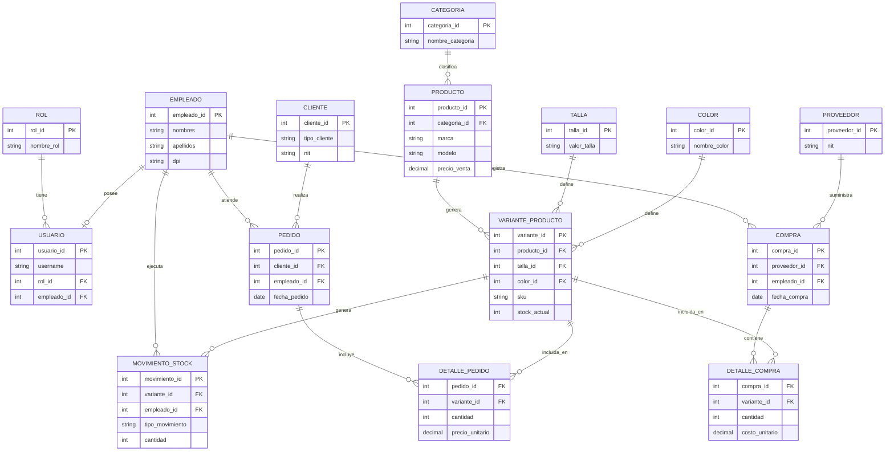

# ENTREGA 1 — Análisis, Propuesta y Diseño Conceptual
## Sistema de Gestión de Inventario y Distribución de Calzado — Pavanamoon

**Universidad Mariano Gálvez de Guatemala**
**Curso:** Bases de Datos
**SGBD seleccionado:** MySQL *(confirmado — dentro de las opciones permitidas por la guía del proyecto, Sección 3)*
**Fecha:** Semana 1–3

---

## 1. Descripción del problema real

Pavanamoon es una empresa dedicada a la comercialización y distribución de calzado deportivo (fútbol) y casual/urbano. Atiende dos segmentos de cliente con dinámicas distintas:

- **B2C (detalle):** clientes individuales que compran unidades sueltas.
- **B2B (mayoreo):** comercios y revendedores que compran en volumen y acceden a condiciones diferenciadas (descuentos por tipo de cliente).

El crecimiento en volumen de mercadería ha generado los siguientes problemas operativos que la empresa busca resolver mediante un sistema de base de datos relacional centralizado:

1. **Control de inventario disperso o manual:** no existe trazabilidad confiable de existencias por modelo, talla y color, lo que genera sobreventas o quiebres de stock no detectados a tiempo.
2. **Falta de historial de movimientos:** entradas por compra, salidas por venta, y devoluciones no quedan registradas de forma auditable.
3. **Gestión de proveedores no estructurada:** no hay un registro histórico de qué se compró, a quién y cuándo, dificultando la negociación y el control de costos.
4. **Segmentación de clientes inexistente en el sistema:** no se diferencia formalmente entre venta al detalle y venta al por mayor, lo que impide aplicar reglas de negocio (precios, descuentos) de forma consistente.
5. **Sin control de acceso por rol:** cualquier persona con acceso al sistema actual puede realizar cualquier operación, sin distinción entre funciones de bodega, ventas y administración.

## 2. Propuesta de solución

Se propone diseñar e implementar un **sistema de base de datos relacional** en MySQL que centralice:

- Catálogo de productos (categoría deportivo/casual, marca, modelo) y sus variantes por talla y color, cada una con su propio nivel de stock.
- Gestión de proveedores y órdenes de compra con detalle de mercadería ingresada.
- Gestión de clientes (individuales y mayoristas) y procesamiento de pedidos/ventas con su detalle.
- Registro completo de movimientos de stock (entradas, salidas, devoluciones de cliente y devoluciones a proveedor), permitiendo reconstruir el kardex de cualquier variante de producto.
- Seguridad basada en roles (Administrador, Bodeguero, Vendedor) con privilegios diferenciados a nivel de base de datos.

El sistema se acompañará de una interfaz web mínima (a partir de la Entrega 2) que consumirá esta base de datos, siguiendo los estándares de calidad de código y seguridad definidos en la guía del proyecto (consultas parametrizadas, separación de capas, manejo controlado de errores).

## 3. Alcance de la Entrega 1

Esta entrega cubre exclusivamente la fase de **análisis y diseño conceptual**: identificación de requerimientos, modelo Entidad-Relación en notación Chen, y planificación del proyecto. No incluye implementación de DDL (que inicia en Entrega 2, tras aprobación del ER, según la Consideración General #9 de la guía).

---

## 4. Requerimientos Funcionales (RF)

### Módulo 1 — Gestión de Inventario y Productos
| ID | Requerimiento |
|---|---|
| RF01 | El sistema debe permitir registrar productos, clasificados por categoría (deportivo/casual), marca y modelo. |
| RF02 | El sistema debe permitir registrar variantes de un producto por combinación única de talla y color, cada una con su propio stock. |
| RF03 | El sistema debe permitir consultar el stock disponible de cualquier variante en tiempo real. |
| RF04 | El sistema debe permitir identificar variantes cuyo stock esté por debajo de un umbral mínimo definido. |
| RF05 | El sistema debe permitir actualizar el precio de venta de un producto. |

### Módulo 2 — Compras y Proveedores
| ID | Requerimiento |
|---|---|
| RF06 | El sistema debe permitir registrar proveedores con su información de contacto. |
| RF07 | El sistema debe permitir registrar una orden de compra asociada a un proveedor, con el detalle de variantes y cantidades adquiridas. |
| RF08 | El sistema debe registrar el ingreso de mercadería a bodega y actualizar automáticamente el stock de las variantes correspondientes. |
| RF09 | El sistema debe permitir consultar el historial de compras realizadas a un proveedor específico. |

### Módulo 3 — Clientes y Pedidos/Distribución
| ID | Requerimiento |
|---|---|
| RF10 | El sistema debe permitir registrar clientes, diferenciando entre tipo individual y tipo mayorista/comercio. |
| RF11 | El sistema debe permitir registrar un pedido asociado a un cliente, con el detalle de variantes, cantidades y precios de venta. |
| RF12 | El sistema debe calcular automáticamente el total de un pedido a partir de su detalle. |
| RF13 | El sistema debe aplicar un descuento diferenciado a clientes de tipo mayorista según la regla de negocio definida. |
| RF14 | El sistema debe permitir consultar el historial de pedidos de un cliente. |

### Módulo 4 — Movimientos de Stock
| ID | Requerimiento |
|---|---|
| RF15 | El sistema debe registrar todo movimiento de stock (entrada, salida, devolución de cliente, devolución a proveedor) con fecha y responsable. |
| RF16 | El sistema debe mantener un historial completo y auditable de movimientos por variante de producto (kardex). |
| RF17 | El sistema debe permitir procesar devoluciones de clientes, ajustando el stock correspondiente automáticamente. |
| RF18 | El sistema debe permitir generar un reporte de movimientos filtrado por variante y rango de fechas. |

### Módulo 5 — Usuarios y Control de Acceso
| ID | Requerimiento |
|---|---|
| RF19 | El sistema debe permitir gestionar roles de usuario: Administrador, Bodeguero y Vendedor. |
| RF20 | El sistema debe autenticar usuarios mediante credenciales únicas antes de permitir operaciones. |
| RF21 | El sistema debe restringir las operaciones disponibles según el rol asignado al usuario autenticado. |

---

## 5. Requerimientos de Datos (RD)

| ID | Requerimiento de datos |
|---|---|
| RD01 | Todo producto debe estar asociado obligatoriamente a una categoría. |
| RD02 | Una variante de producto se identifica de forma única por la combinación producto + talla + color. |
| RD03 | El stock de una variante nunca puede ser negativo (restricción CHECK). |
| RD04 | Todo pedido debe estar asociado a un cliente y a un empleado (vendedor) responsable. |
| RD05 | Toda compra debe estar asociada a un proveedor y a un empleado (bodeguero/comprador) responsable. |
| RD06 | La fecha de cada movimiento de stock, compra y pedido debe registrarse automáticamente al momento de la transacción. |
| RD07 | El NIT/identificador fiscal de cliente y proveedor debe ser único. |
| RD08 | El nombre de usuario (username) debe ser único por usuario del sistema. |
| RD09 | Todo usuario del sistema debe tener asignado exactamente un rol. |
| RD10 | El tipo de movimiento de stock debe restringirse a un conjunto cerrado de valores (entrada, salida, devolución de cliente, devolución a proveedor). |
| RD11 | El precio unitario y la cantidad en el detalle de compras/pedidos deben ser valores positivos. |

---

## 6. Matriz de trazabilidad (Requerimiento → Entidad)

| Requerimiento | Entidad(es) principal(es) relacionada(s) | Módulo |
|---|---|---|
| RF01, RF05, RD01 | PRODUCTO, CATEGORIA | Inventario |
| RF02, RF03, RF04, RD02, RD03 | VARIANTE_PRODUCTO, TALLA, COLOR | Inventario |
| RF06, RD07 | PROVEEDOR | Compras |
| RF07, RF09, RD05, RD11 | COMPRA, DETALLE_COMPRA | Compras |
| RF08 | COMPRA, DETALLE_COMPRA, VARIANTE_PRODUCTO, MOVIMIENTO_STOCK | Compras / Inventario |
| RF10, RD07 | CLIENTE | Clientes |
| RF11, RF12, RF13, RF14, RD04, RD11 | PEDIDO, DETALLE_PEDIDO, CLIENTE | Pedidos |
| RF15, RF16, RF17, RF18, RD06, RD10 | MOVIMIENTO_STOCK, VARIANTE_PRODUCTO | Movimientos |
| RF19, RF20, RF21, RD08, RD09 | ROL, USUARIO, EMPLEADO | Seguridad |

*Esta matriz se actualizará en cada entrega conforme avance la implementación (estándar D4).*

---

## 7. Diseño conceptual — Modelo Entidad-Relación (Notación Chen)

### 7.1 Nota metodológica sobre herramientas de diagramación

La guía del proyecto exige notación Chen (óvalos para atributos, rombos para relaciones, rectángulos para entidades). **Ni Mermaid.js ni PlantUML soportan nativamente notación Chen**; ambas herramientas generan diagramas ER en notación Crow's Foot / IE. Por lo tanto:

- Se incluye a continuación la **especificación textual completa en notación Chen** (entidades, atributos clasificados, relaciones con cardinalidades), que es la fuente de verdad del modelo.
- Se incluye un **diagrama Mermaid como vista rápida de apoyo** (no reemplaza el diagrama Chen oficial).
- El **diagrama Chen oficial en formato editable + PNG/PDF** (estándar D3) debe elaborarse en **draw.io o Lucidchart** a partir de esta especificación, y guardarse en `/docs/diagramas/`.

### 7.2 Entidades principales (13)

> Convención: **PK** = llave primaria, **FK** = llave foránea, *[multivaluado]*, *{derivado}*, *UK* = único.

1. **ROL** (rol_id **PK**, nombre_rol *UK*, descripcion)
2. **USUARIO** (usuario_id **PK**, username *UK*, password_hash, estado, fecha_creacion, rol_id **FK**, empleado_id **FK**)
3. **EMPLEADO** (empleado_id **PK**, nombres, apellidos, dpi *UK*, telefono *[multivaluado]*, fecha_contratacion, salario)
4. **CLIENTE** (cliente_id **PK**, tipo_cliente {individual|mayorista}, nombre_razon_social, nit *UK*, telefono *[multivaluado]*, email, direccion, porcentaje_descuento)
5. **PROVEEDOR** (proveedor_id **PK**, nombre_empresa, nit *UK*, telefono, email, direccion, contacto_nombre)
6. **CATEGORIA** (categoria_id **PK**, nombre_categoria {deportivo|casual}, descripcion)
7. **PRODUCTO** (producto_id **PK**, categoria_id **FK**, marca, modelo, descripcion, precio_venta, genero, fecha_registro)
8. **TALLA** (talla_id **PK**, valor_talla *UK*)
9. **COLOR** (color_id **PK**, nombre_color *UK*, codigo_hex)
10. **VARIANTE_PRODUCTO** (variante_id **PK**, producto_id **FK**, talla_id **FK**, color_id **FK**, sku *{derivado: producto+talla+color}* *UK*, stock_actual, stock_minimo)
11. **COMPRA** (compra_id **PK**, proveedor_id **FK**, empleado_id **FK**, fecha_compra, total_compra *{derivado}*, estado)
12. **PEDIDO** (pedido_id **PK**, cliente_id **FK**, empleado_id **FK**, fecha_pedido, tipo_venta {detalle|mayorista}, total_pedido *{derivado}*, estado)
13. **MOVIMIENTO_STOCK** (movimiento_id **PK**, variante_id **FK**, empleado_id **FK**, tipo_movimiento {entrada|salida|devolucion_cliente|devolucion_proveedor}, cantidad, fecha_movimiento, referencia_documento, observaciones)

### 7.3 Entidades asociativas — Relaciones N:M resueltas (2 requeridas, mínimo cumplido)

- **DETALLE_COMPRA** (compra_id **FK**, variante_id **FK**, cantidad, costo_unitario, subtotal *{derivado}*) → resuelve **COMPRA (N,M) VARIANTE_PRODUCTO**
- **DETALLE_PEDIDO** (pedido_id **FK**, variante_id **FK**, cantidad, precio_unitario, subtotal *{derivado}*) → resuelve **PEDIDO (N,M) VARIANTE_PRODUCTO**

### 7.4 Relaciones (con cardinalidades, notación (mín,máx))

| Relación (rombo Chen) | Entidad A | Cardinalidad | Entidad B | Cardinalidad |
|---|---|---|---|---|
| tiene | ROL | (1,1) | USUARIO | (0,N) |
| posee | EMPLEADO | (0,1) | USUARIO | (1,1) |
| registra | EMPLEADO | (0,N) | COMPRA | (1,1) |
| atiende | EMPLEADO | (0,N) | PEDIDO | (1,1) |
| ejecuta | EMPLEADO | (0,N) | MOVIMIENTO_STOCK | (1,1) |
| suministra | PROVEEDOR | (0,N) | COMPRA | (1,1) |
| realiza | CLIENTE | (0,N) | PEDIDO | (1,1) |
| clasifica | CATEGORIA | (1,N) | PRODUCTO | (1,1) |
| genera | PRODUCTO | (1,N) | VARIANTE_PRODUCTO | (1,1) |
| se_define_en_talla | TALLA | (1,N) | VARIANTE_PRODUCTO | (1,1) |
| se_define_en_color | COLOR | (1,N) | VARIANTE_PRODUCTO | (1,1) |
| **contiene** (N:M) | COMPRA | (1,N) | VARIANTE_PRODUCTO | (0,N) *(vía DETALLE_COMPRA)* |
| **incluye** (N:M) | PEDIDO | (1,N) | VARIANTE_PRODUCTO | (0,N) *(vía DETALLE_PEDIDO)* |
| genera_movimiento | VARIANTE_PRODUCTO | (0,N) | MOVIMIENTO_STOCK | (1,1) |

### 7.5 Vista de apoyo — Mermaid ER (notación Crow's Foot, referencial)

### 7.6 Resumen de cumplimiento de requisitos mínimos del sistema

| Requisito mínimo del proyecto | Cumplimiento en este diseño |
|---|---|
| ≥8 entidades principales | ✅ 13 entidades principales (sin contar asociativas) |
| ≥2 relaciones N:M resueltas | ✅ COMPRA↔VARIANTE_PRODUCTO y PEDIDO↔VARIANTE_PRODUCTO, vía DETALLE_COMPRA y DETALLE_PEDIDO |
| Normalización 3FN | Se demostrará con ejemplo en Entrega 2 (ej. separación de TALLA/COLOR como catálogos evita dependencias transitivas y redundancia en VARIANTE_PRODUCTO) |
| ≥15 restricciones explícitas | Se implementan en DDL (Entrega 2): PKs, FKs, UNIQUE (nit, username, sku), CHECK (stock_actual >= 0, cantidad > 0, tipo_movimiento IN (...)), NOT NULL |
| ≥2 triggers / procedimientos | Planeado para Entrega 3: trigger de actualización automática de stock al insertar DETALLE_COMPRA/DETALLE_PEDIDO/MOVIMIENTO_STOCK; procedimiento de cálculo de total de pedido con descuento mayorista |
| ≥3 roles de seguridad | Administrador, Bodeguero, Vendedor — ya reflejados en entidad ROL |

---

## 8. Planificación — Cronograma (Gantt textual, 12 semanas)

| Semana | Actividad | Entregable | Responsable(s) |
|---|---|---|---|
| 1 | Levantamiento del caso de negocio y RF/RD | Borrador de requerimientos | Todo el equipo |
| 2 | Diseño del modelo ER (Chen) y matriz de trazabilidad | ER conceptual v1 | Todo el equipo |
| 3 | Redacción de propuesta, README, cierre Entrega 1 | **ENTREGA 1 (tag entrega-1)** | Todo el equipo |
| 4 | Modelo relacional, normalización 3FN, diccionario de datos | Modelo lógico | Todo el equipo |
| 5 | Scripts DDL, INSTALL.md, login + 2 CRUD web (30%) | **ENTREGA 2 (tag entrega-2)** | Todo el equipo |
| 6 | DML de carga de datos de prueba (≥50 registros/tabla) | Scripts DML | Bodeguero de datos (rotativo) |
| 7 | Vistas, triggers, procedimientos almacenados | Scripts SQL avanzados | Todo el equipo |
| 8 | Seguridad (3 roles BD), casos de prueba, app web 70% | **ENTREGA 3 (tag entrega-3)** | Todo el equipo |
| 9 | Completar módulos web restantes | Avance funcional | Todo el equipo |
| 10 | Control de acceso por rol en la app, manuales | Documentación técnica/usuario | Todo el equipo |
| 11 | Pruebas de integración, instalación desde cero | Informe final borrador | Todo el equipo |
| 12 | Integración final, defensa oral | **ENTREGA 4 + Defensa (tag entrega-4)** | Todo el equipo |

---

## 9. Declaración de uso de agentes de IA

El equipo utilizó un agente de IA (Claude, Anthropic) como asistente en la redacción de esta propuesta, el diseño conceptual del modelo ER y la generación del script de automatización de repositorio. El detalle completo del uso, prompts y validación se documenta en `docs/bitacora-ia/BITACORA_IA.md`, conforme al estándar S8/R-Bitácora del proyecto.

